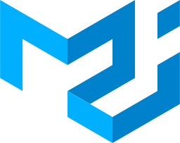

# Hi there! 👋

You have stayed on my page for:

## About me 🚀

### I'm a entry level fullstack developer 🧑‍💻 (HTML + CSS, JS, React.js, Node.js)

- 👀 I’m interested in **computer programming & coding**
- 🌱 I’m currently learning **Node.js**, and constantly learning new things

 
 

### Skills & Tools : 

 

 
 

### How to find me :

 

