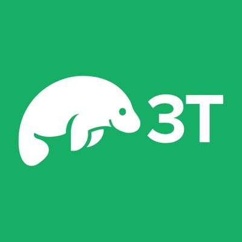

# Hi there! 👋

You have stayed on my page for:

## About Me 🚀

Hello there! 👋 I'm an enthusiastic entry-level full-stack developer 🧑‍💻 with a solid understanding in **HTML, CSS, JavaScript, React.js, and Node.js**. I recently completed a comprehensive programming course that equipped me with the skills to dive headfirst into the world of web development.

### My Passion 💡

I have a deep-seated passion for **computer programming and coding** that drives my curiosity and fuels my desire to create innovative applications. The dynamic nature of the tech industry captivates me, and I'm committed to staying at the forefront of emerging technologies.

### My Journey 🌟

My journey as a developer has just begun, and I see it as a lifelong adventure. I'm excited about the prospect of continually learning and evolving in this ever-changing field. I find immense joy in turning ideas into functional, user-friendly applications that can make a positive impact.

### What's Next? 🌱

As an aspiring developer, I'm eager to collaborate on exciting projects, learn from experienced professionals, and contribute to the vibrant open-source community. I'm here to absorb knowledge, embrace challenges, and turn my coding dreams into reality.

Let's connect, collaborate, and create amazing things together! 🌐✨

 
 

### Skills & Tools : 

 

 
 

### How to find me :

 

